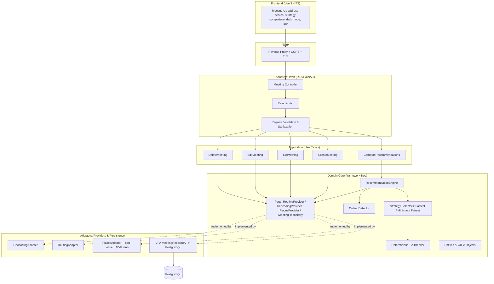
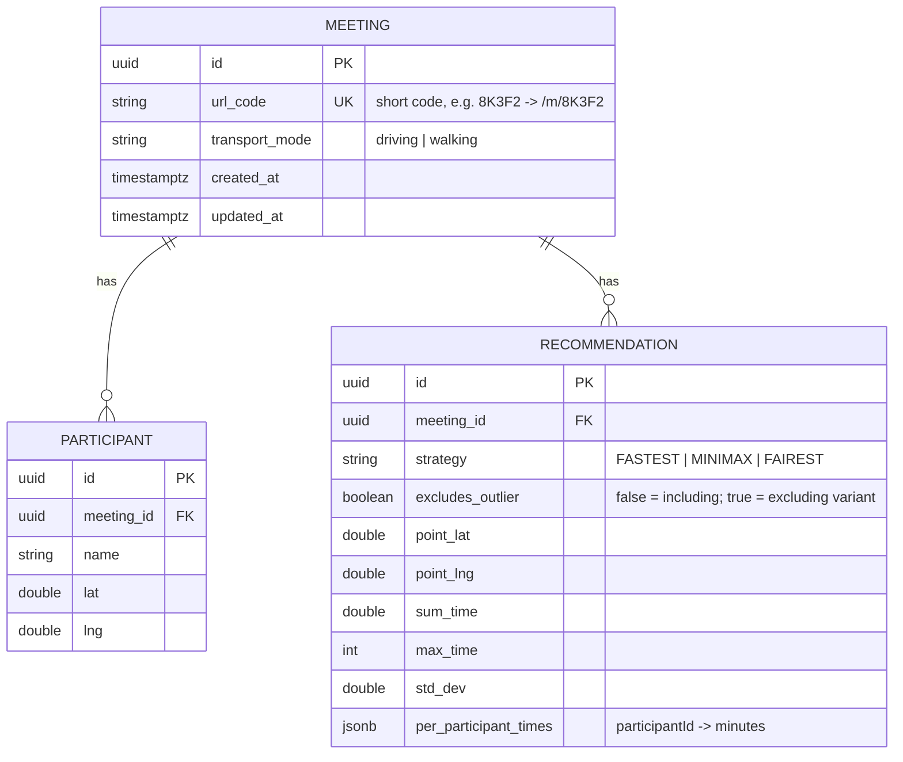

# Design Document

## Overview

This document describes the technical design of the **Meeting Recommendation Engine** for MeetHalfway. The engine takes a set of participant locations and a shared transport mode and returns three recommended meeting points — **Fastest**, **Minimax**, and **Fairest** — each selected by minimizing a metric over real travel times rather than by picking the geographic midpoint. The design realizes the functional behavior defined in [requirements.md](./requirements.md) (Requirements 1–12).

The design follows **Clean Architecture** and strict **SOLID** principles. The optimization logic sits in a pure domain core that has no knowledge of frameworks, HTTP, databases, or specific third-party providers. All contact with the outside world — geocoding, routing, persistence, HTTP — happens through **ports (interfaces)** implemented by **adapters** at the edges. This is what makes the requirement "swap a provider without touching the core" (project convention, Requirement 5.4 and 11.5) mechanically true: the core depends only on the `RoutingProvider`, `GeocodingProvider`, and `PlacesProvider` interfaces, never on their implementations.

Two properties dominate the design:

1. **Determinism.** The same inputs must always produce the same outputs (Requirements 2–4 tie-break chains). We achieve this with a fixed candidate-generation procedure, a fixed float `Equality_Threshold (ε ≈ 0.5 min)`, and a total tie-break order that always terminates at the distance to the `Geographic_Centroid`.
2. **City-agnosticism.** No Medellín-specific number appears in the optimization code. Service bounds, grid density `N`, maximum search radius, outlier threshold, and provider settings all live in `Configuration` (Requirements 5.4, 11.5, and the Open Questions section). The algorithm reads them; it never hard-codes them.

### Technology Stack

| Layer | Choice | Notes |
| --- | --- | --- |
| Frontend | Vue.js 3 + TypeScript (`strict: true`) | Desktop-first, dark mode, i18n ES/EN (Req 10) |
| Backend | Spring Boot (Java) | Clean Architecture; domain core is framework-free |
| Database | PostgreSQL | Meetings, Participants, Recommendations (Req 9) |
| Cache | None (MVP) | No Redis in MVP; explicit decision |
| Packaging | Docker + Docker Compose | 100% local run and GCP single-instance deploy |
| Edge | Nginx reverse proxy | Terminates HTTP, routes `/api/v1` to backend |
| API | REST under `/api/v1` | Versioned (Req 11.1) |

Only free / open-source external technologies are used. Free services with rate limits are acceptable. API keys are allowed but are held backend-only and never exposed to the frontend (Requirement 11.4).

### Monorepo Structure

```
meethalfway/
├── frontend/                      # Vue 3 + TS (strict) SPA
├── backend/                       # Spring Boot; Clean Architecture layers
│   ├── domain/                    # Pure core: entities, value objects, engine, ports
│   ├── application/               # Use cases / orchestration
│   ├── adapters/                  # Provider adapters, persistence, web (REST)
│   └── config/                    # Externalized Configuration binding
├── docs/
│   ├── architecture.md
│   ├── algorithms.md
│   ├── testing.md
│   └── decisions/
│       ├── ADR-001-routing-provider.md
│       └── ADR-002-optimization-strategies.md
├── nginx/
├── .kiro/
└── docker-compose.yml
```

Two Architecture Decision Records are authored alongside this design:

- **ADR-001 (Routing Provider):** records which free/open-source routing service is chosen behind the `RoutingProvider` port, its rate limits, and the fallback plan. The port isolates this choice so it can be revisited without changing the core.
- **ADR-002 (Optimization Strategies):** records the mathematical definition of the three strategies, the fixed 15% `Efficiency_Tolerance`, the `ε` tie-break threshold, and the deterministic tie-break chains — the rationale behind Requirements 2–4.

## Architecture

### Layered View (Clean Architecture)



The dependency rule points inward: `Domain` depends on nothing; `Application` depends on `Domain`; `Adapters` depend on `Application` and `Domain` (by implementing their ports). Providers are injected via **explicit Dependency Injection** so tests can substitute deterministic fakes for the `RoutingProvider` and `GeocodingProvider` (this is what makes the correctness properties runnable offline).

### Ports (Hexagonal Boundaries)

| Port | Responsibility | MVP status |
| --- | --- | --- |
| `GeocodingProvider` | Resolve an address string to a `Coordinate`; power autocomplete (Req 9.7) | Active |
| `RoutingProvider` | Compute real `Travel_Time` from an origin to a candidate for a `Transport_Mode` (Req 2.1, 5.2) | Active |
| `PlacesProvider` | List establishments near a point (post-MVP, Future note) | Defined, stubbed |
| `MeetingRepository` | Persist / retrieve / delete Meetings and Recommendations (Req 9) | Active |

Defining `PlacesProvider` now — even though it is only stubbed — keeps the post-MVP "list establishments in the zone" increment a matter of writing an adapter, not restructuring the core.

### Recommendation Request Flow

```mermaid
sequenceDiagram
    participant C as Creator (UI)
    participant W as Web Adapter (/api/v1)
    participant A as ComputeRecommendations
    participant E as RecommendationEngine
    participant R as RoutingProvider

    C->>W: POST /api/v1/meetings/{code}/recommendations
    W->>W: rate limit, sanitize, validate (Req 1, 11.2)
    W->>A: MeetingInput (participants, mode)
    A->>E: compute(participants, mode, config)
    E->>E: generate N candidates via Grid_Search (Req 5.1)
    loop each candidate x each participant
        E->>R: travelTime(origin, candidate, mode)
        R-->>E: minutes OR routing error
    end
    alt any routing error
        E-->>A: RoutingErrorResult(participant, reason) (Req 6)
        A-->>W: 422 with specific reason
        W-->>C: ask to correct/remove location
    else all routed
        E->>E: metrics per candidate (Σ, max, σ) (Req 5.2)
        E->>E: select Fastest / Minimax / Fairest + tie-break (Req 2-4)
        E->>E: detect outliers; if any, dual compute (Req 7)
        E-->>A: Recommendations (+ outlier trade-off)
        A-->>W: 200 with results
        W-->>C: render three strategy points + metrics (Req 8)
    end
```

### Cross-Cutting Concerns

- **Validation & sanitization** (Req 1.6–1.8) run at the web adapter before any use case executes; domain entities re-validate their own invariants on construction so the core cannot be built in an invalid state.
- **Rate limiting** (Req 11.2) is a web-adapter filter keyed by client identity (IP), returning HTTP 429 when the configured limit is exceeded.
- **CORS** (Req 11.3) permits only configured origins; enforced at Nginx and re-asserted by the backend.
- **API keys** (Req 11.4) are read from backend Configuration/secrets and used only inside provider adapters. They never cross into any response body or the frontend bundle.
- **i18n & dark mode** (Req 10) are frontend concerns: message catalogs for ES/EN, a language selector, and a dark theme as the default and only MVP theme.

## Components and Interfaces

### Domain Core

#### `RecommendationEngine`
The orchestrator of a single computation. It owns no I/O; it receives a `RoutingProvider` and a `Configuration` snapshot by injection.

```java
public interface RecommendationEngine {
    // Throws no checked exception for routing failures; returns a result type instead (Req 6).
    RecommendationOutcome compute(MeetingInput input, EngineConfig config, RoutingProvider routing);
}
```

`RecommendationOutcome` is a sealed result:
- `Success(StrategyResults results, OutlierTradeoff tradeoff?)` — three strategy results, plus an optional outlier trade-off when at least one outlier exists (Req 7).
- `RoutingFailure(List<RoutingError> errors)` — one or more participant locations that could not be routed, each with a specific reason (Req 6.1). No recommendation is produced; nothing is silently excluded (Req 6.3, 6.4).

#### `CandidateGenerator` (Grid_Search)
Generates `N` `Candidate_Point`s over a bounded region (Req 5.1). `N`, the maximum search radius, and the grid origin/bounds come from `EngineConfig` (Req 5.4). Generation is deterministic given the same participants and config — this is a precondition for output determinism.

```java
public interface CandidateGenerator {
    List<Coordinate> generate(List<Coordinate> origins, EngineConfig config);
}
```

#### `StrategySelector`
Given the evaluated candidates (each carrying its metrics), selects the single winner per strategy applying the tie-break chain. There is one selector per strategy but they share a common `TieBreaker`.

```java
public interface StrategySelector {
    EvaluatedCandidate select(List<EvaluatedCandidate> candidates, Coordinate centroid);
}
```

- **FastestSelector** (Req 2): key order `Σ → max → σ → distance-to-centroid`.
- **MinimaxSelector** (Req 3): key order `max → Σ → σ → distance-to-centroid`.
- **FairestSelector** (Req 4): first restricts to the feasible set `Σ ≤ 1.15 · T*` (where `T* = min Σ` from the Fastest computation), then key order `σ → Σ → max → distance-to-centroid`.

#### `TieBreaker`
Encapsulates float-tolerant comparison using `Equality_Threshold (ε)`: `areEqual(a, b) := |a − b| < ε`, with `ε` from config (`≈ 0.5 min`). It composes an ordered list of comparators and guarantees a **total order** because the final comparator — distance to the `Geographic_Centroid` — is applied without the ε tolerance, so it strictly orders any residual tie. (If two candidates are literally the same point, they are interchangeable and selection is still well-defined.)

#### `OutlierDetector`
Applies the configured outlier rule to the per-participant travel times of a reference computation (Req 7.1). The rule is **config-driven** and not hard-coded: the MVP form is `t_i > k · median(t)` (candidate `k ≈ 2`) or a `p90`-based rule, with the exact parameter pending calibration (see Open Questions). When at least one outlier is present, the engine computes all three strategies twice — including and excluding the outlier(s) — and returns both, each with the selected point and the **group average travel time**, so the Creator can compare (Req 7.2, 7.3). The engine never drops an outlier silently (Req 7.5).

```java
public interface OutlierDetector {
    Set<ParticipantId> detect(Map<ParticipantId, Minutes> travelTimes, EngineConfig config);
}
```

### Ports to the Outside World

```java
public interface RoutingProvider {
    // Returns whole-minute travel time, or a typed error carrying a reason (Req 6.1).
    RouteResult travelTime(Coordinate origin, Coordinate destination, TransportMode mode);
}

public interface GeocodingProvider {
    List<AddressSuggestion> autocomplete(String query, EngineConfig config); // Req 9.7
    GeocodeResult resolve(String address);
}

public interface PlacesProvider { // Defined for post-MVP; stub in MVP
    List<Place> nearby(Coordinate center, PlaceQuery query);
}

public interface MeetingRepository {
    Meeting save(Meeting meeting);
    Optional<Meeting> findByUrlCode(String urlCode);
    void deleteByUrlCode(String urlCode);
}
```

### Application (Use Cases)

- **CreateMeeting** (Req 9.1): validates input, generates a `Meeting_URL` short code, persists the Meeting.
- **GetMeeting** (Req 9.2, 9.3): resolves a Meeting by URL code with no identity control; returns participants, mode, and stored Recommendations.
- **EditMeeting** (Req 9.4): applies changes to participant count/names/locations and persists.
- **DeleteMeeting** (Req 9.5): removes the Meeting.
- **ComputeRecommendations** (Req 2–8): drives the engine and persists the produced Recommendations.

### Web Adapter (REST `/api/v1`)

| Method & Path | Use Case | Notes |
| --- | --- | --- |
| `POST /api/v1/meetings` | CreateMeeting | Returns Meeting with `urlCode` |
| `GET /api/v1/meetings/{code}` | GetMeeting | No auth (Req 9.2) |
| `PUT /api/v1/meetings/{code}` | EditMeeting | Persists edits (Req 9.4) |
| `DELETE /api/v1/meetings/{code}` | DeleteMeeting | (Req 9.5) |
| `POST /api/v1/meetings/{code}/recommendations` | ComputeRecommendations | Returns three strategies (+ outlier trade-off) or a routing-error 422 |
| `GET /api/v1/geocode/autocomplete?q=` | Geocoding autocomplete | Backend proxies provider; keys stay backend-only (Req 9.7, 11.4) |

### Frontend Components (Vue 3 + TS, strict)

- **AddressSearchBox**: autocomplete-backed address entry per participant (Req 9.7); no map-click selection in MVP (Req 9.8).
- **StrategyComparisonView**: renders the three strategy points with per-participant travel time, `Σ`, `max`, `σ` (Req 8.2).
- **OutlierTradeoffPanel**: shows the include-vs-exclude comparison and lets the Creator decide (Req 7.3, 7.4).
- **LanguageSelector / ThemeProvider**: ES/EN switch and dark-mode default (Req 10).

## Data Models

### Domain Value Objects (immutable)

```java
record Coordinate(double lat, double lng) {
    // Invariant: -90 <= lat <= 90 and -180 <= lng <= 180 (Req 1.6)
}

enum TransportMode { DRIVING, WALKING } // Req 1.4

record Minutes(int value) { // whole-minute travel time (Req 8); non-negative
    // Invariant: value >= 0
}

record ParticipantInput(ParticipantId id, String name, Coordinate location);

record MeetingInput(List<ParticipantInput> participants, TransportMode mode) {
    // Invariant: 2 <= participants.size() <= 10 (Req 1.1-1.3)
}

record EvaluatedCandidate(
    Coordinate point,
    Map<ParticipantId, Minutes> perParticipant,
    double sumTime,      // Σ t_i
    int    maxTime,      // max t_i
    double stdDev        // σ(t)
);

record StrategyResult(
    Coordinate point,
    Map<ParticipantId, Minutes> perParticipant,
    double sumTime,
    int    maxTime,
    double stdDev
);

record StrategyResults(StrategyResult fastest, StrategyResult minimax, StrategyResult fairest);

record OutlierTradeoff(
    Set<ParticipantId> outliers,
    StrategyResults including,
    StrategyResults excluding,
    double avgTravelTimeIncluding,
    double avgTravelTimeExcluding
);
```

### EngineConfig (externalized — city-agnostic)

All city-specific and tuning values are read from `Configuration`, never embedded in logic (Req 5.4, 11.5, Open Questions).

```java
record EngineConfig(
    ServiceBounds serviceBounds,        // lat/lng box for the served region (Req 1.7)
    int    gridDensityN,                // Candidate count for Grid_Search (Open Question: N)
    double maxSearchRadiusMeters,       // Grid extent (Open Question: max radius)
    OutlierRule outlierRule,            // e.g. MEDIAN_MULTIPLE(k) or PERCENTILE(p90) (Open Question)
    double epsilonMinutes               // Equality_Threshold ε ≈ 0.5 (config-driven)
    // Efficiency_Tolerance is NOT here: it is a fixed 15% constant (Req 4.3).
);
```

The `Efficiency_Tolerance` of 15% is deliberately **not** a config field — Requirement 4.3 mandates it be a fixed constant, so it lives as a domain constant `EFFICIENCY_TOLERANCE = 0.15`.

### PostgreSQL Schema



Notes:
- **No authentication and no user identity** anywhere in the schema (Req 9.2). Access is by `url_code` alone.
- `url_code` is a short, URL-safe, collision-checked code generating paths like `/m/8K3F2` (Req 9.1, Meeting_URL).
- `RECOMMENDATION.excludes_outlier` lets a single table hold both the including and excluding variants when an outlier trade-off is stored (Req 7).
- `created_at` / `updated_at` support meeting history retention (Req 9.6).

## Correctness Properties

*A property is a characteristic or behavior that should hold true across all valid executions of a system — essentially, a formal statement about what the system should do. Properties serve as the bridge between human-readable specifications and machine-verifiable correctness guarantees.*

The recommendation engine is a near-pure computation (participants + mode + config → results) with a `RoutingProvider` port that can be replaced by a deterministic fake in tests. This makes property-based testing both applicable and high value: the input space (participant sets, coordinates, travel-time matrices, tie configurations) is large, and the strategies have precise universal properties (optimality, feasibility, determinism). The properties below were derived from the prework analysis and consolidated to remove redundancy (the nine individual tie-break sub-criteria collapse into per-strategy optimality plus determinism and totality; the result-shape criteria collapse into one completeness property).

### Property 1: Participant-count validation invariant

*For any* candidate meeting, the engine accepts it only if its participant count is between 2 and 10 inclusive; any count below 2 or above 10 is rejected with a validation error identifying the violated bound.

**Validates: Requirements 1.1, 1.2, 1.3**

### Property 2: Transport-mode validation invariant

*For any* submitted transport-mode value, the engine accepts the meeting only when the mode is exactly "driving" or "walking"; any other value is rejected with a validation error naming the supported modes.

**Validates: Requirements 1.4, 1.5**

### Property 3: Coordinate and service-bounds validation invariant

*For any* participant location, the engine accepts the meeting only if every location has latitude in [-90, 90], longitude in [-180, 180], and falls within the configured service bounds; otherwise the meeting is rejected with an error identifying the offending participant.

**Validates: Requirements 1.6, 1.7**

### Property 4: Metric consistency

*For any* candidate point and any set of per-participant travel times, the candidate's `Sum_Time` equals the arithmetic sum of those times, its `Max_Time` equals their maximum, and its `Std_Dev` equals their standard deviation.

**Validates: Requirements 5.2**

### Property 5: Fastest optimality

*For any* accepted meeting, no evaluated candidate has a `Sum_Time` strictly lower than the Fastest_Strategy result's `Sum_Time` beyond the `Equality_Threshold` ε.

**Validates: Requirements 2.2**

### Property 6: Minimax optimality

*For any* accepted meeting, no evaluated candidate has a `Max_Time` strictly lower than the Minimax_Strategy result's `Max_Time` beyond the `Equality_Threshold` ε.

**Validates: Requirements 3.1**

### Property 7: Fairest feasibility invariant

*For any* accepted meeting, the Fairest_Strategy result's `Sum_Time` is always less than or equal to 1.15 · T\* (within ε), where T\* is the minimum `Sum_Time` across all candidates.

**Validates: Requirements 4.1, 4.2, 4.3**

### Property 8: Fairest optimality within the feasible set

*For any* accepted meeting, no candidate in the feasible set (`Σ ≤ 1.15 · T\*`) has a `Std_Dev` strictly lower than the Fairest_Strategy result's `Std_Dev` beyond the `Equality_Threshold` ε.

**Validates: Requirements 4.4**

### Property 9: Tie-break totality

*For any* set of evaluated candidates, each strategy's tie-break comparator chain — ending in distance to the `Geographic_Centroid` applied without the ε tolerance — yields a single selected candidate with no unresolved tie.

**Validates: Requirements 2.3, 2.4, 2.5, 3.2, 3.3, 3.4, 4.5, 4.6, 4.7**

### Property 10: Determinism

*For any* meeting input, engine configuration, and routing behavior, running the computation twice produces identical results for all three strategies (identical selected points and metrics).

**Validates: Requirements 2.2, 2.3, 2.4, 2.5, 3.1, 3.2, 3.3, 3.4, 4.4, 4.5, 4.6, 4.7**

### Property 11: Grid generation count and bounds

*For any* engine configuration, `Grid_Search` generates exactly `N` candidate points and every generated point lies within the configured search region.

**Validates: Requirements 5.1**

### Property 12: Results completeness and shape

*For any* successful computation, the output contains exactly one result for each of the Fastest, Minimax, and Fairest strategies; each result carries a valid in-range coordinate and, for every participant in the meeting, a per-participant `Travel_Time` alongside consistent `Sum_Time`, `Max_Time`, and `Std_Dev`.

**Validates: Requirements 6.4, 8.1, 8.2, 8.3**

### Property 13: Routing-failure transparency

*For any* meeting in which the routing provider fails for at least one participant location, the engine returns a routing-failure outcome that identifies each affected participant location and its specific reason, and never returns strategy recommendations (no participant is silently excluded).

**Validates: Requirements 6.1, 6.3, 6.4**

### Property 14: Outlier detection matches the configured rule

*For any* vector of per-participant travel times, the set of participants marked as outliers exactly equals the configured outlier rule applied to that vector.

**Validates: Requirements 7.1**

### Property 15: Outlier transparency

*For any* meeting containing at least one outlier, the output includes both the including-outlier and excluding-outlier computations for all three strategies, each with its selected point and group average `Travel_Time`, and the engine never drops an outlier without presenting this comparison.

**Validates: Requirements 7.2, 7.3, 7.5**

### Property 16: Travel-time units and non-negativity

*For any* computed travel time, the value is a whole (integer) number of minutes and is non-negative.

**Validates: Requirements 8.2**

### Property 17: Meeting persistence round-trip

*For any* valid meeting, saving it and then retrieving it by its `Meeting_URL` code returns an equivalent meeting with the same participant count, names, locations, transport mode, and recommendations.

**Validates: Requirements 9.1, 9.3**

## Error Handling

Errors are handled so that the system **never fails silently and never silently excludes a location** (Requirements 6, 7).

### Validation errors (Requirement 1)
- Input is sanitized first (Req 1.8), then validated at the web adapter. Domain value objects re-check their invariants on construction, so an invalid `MeetingInput` cannot be built.
- Each validation failure maps to HTTP 400 with a machine-readable code and a message that identifies the offending field or participant: participant-count bound (1.2, 1.3), unsupported transport mode (1.5), out-of-range coordinate (1.6), and out-of-service-bounds location (1.7).

### Routing errors (Requirement 6)
- The `RoutingProvider` returns a typed `RouteResult` — success (whole minutes) or a failure carrying a reason — rather than throwing for expected failures.
- If any participant location cannot be routed, `ComputeRecommendations` returns HTTP 422 with a `RoutingFailure` body listing each affected participant and its specific reason (6.1). The response message asks the Creator to correct or remove the location (6.2).
- No `Success` outcome is produced when any route fails; the engine never returns recommendations that omit an affected participant (6.3, 6.4). This is enforced by Property 13.

### Outlier trade-off (Requirement 7)
- Detected outliers do not cause an error. The engine computes both variants and returns them; the Creator decides (7.4). Silent exclusion is impossible by construction (Property 15).

### Provider and infrastructure faults
- Provider timeouts / rate-limit responses (free-tier limits are expected) are surfaced as routing failures with a clear reason, not as generic 500s, so the Creator gets actionable feedback.
- Rate-limit rejections at the API surface return HTTP 429 (Req 11.2). CORS violations are rejected by policy (Req 11.3). Unexpected internal errors return HTTP 500 with a correlation id and no leaked provider keys or secrets (Req 11.4).

## Testing Strategy

Property-based testing is **mandatory** for the engine per project standards, and it is appropriate here because the engine's core is effectively pure and has universal properties (optimality, feasibility, determinism) over a large input space. UI, i18n, persistence wiring, rate limiting, CORS, and provider integration are **not** subjects for PBT; they use example, snapshot, and integration tests as noted below.

### Dual approach
- **Property tests** cover the universal engine properties (Properties 1–17) across randomized inputs.
- **Unit/example tests** cover specific cases: transport-mode acceptance (1.4), the "not chosen by geographic center" demonstration (5.3), the actionable 422 message (6.2), the creator-decides behavior (7.4), and out-of-scope guards (12.1–12.4).
- **Integration tests** cover geocoding autocomplete/resolve with a fake `GeocodingProvider` (9.7), persistence CRUD (9.4, 9.5, 9.6), and REST wiring under `/api/v1` (11.1).
- **Snapshot / DOM tests** (frontend, Vitest + Vue Test Utils) cover dark mode, desktop-first layout, and ES/EN language switching (10.1–10.5), plus the no-map-click constraint (9.8).
- **Config/structure tests** assert city-specific values come from `EngineConfig` (5.4, 11.5), the 15% tolerance is a fixed constant not a config field (4.3), and no provider key appears in responses or the frontend bundle (11.4).

### Property-based testing library
- **Backend (Java):** use **jqwik** (JUnit 5 property library). Do not hand-roll property testing.
- **Frontend (TypeScript):** use **fast-check** for any pure frontend logic (e.g., metric formatting), integrated with Vitest.

### Property test configuration
- Each correctness property is implemented by a **single** property-based test.
- Each property test runs a **minimum of 100 iterations** (jqwik `@Property(tries = 100)` or more; fast-check `numRuns: 100`).
- The `RoutingProvider` and `GeocodingProvider` are replaced by **deterministic in-memory fakes** in property tests so runs are fast, offline, and reproducible — this is what makes Determinism (Property 10) and the optimality properties testable without external calls.
- Each property test carries a tag comment referencing its design property, in the format:
  **Feature: meeting-recommendation-engine, Property {number}: {property_text}**

### Generators (sketch)
- Participant sets sized 2–10 with coordinates inside/outside service bounds (drives Properties 1, 3).
- Travel-time matrices (fake routing) including engineered ties within ε and injected outliers (drives Properties 4–10, 14, 15, 16).
- `EngineConfig` variations of `N`, max radius, and outlier rule (drives Properties 7, 11, 14) — confirming the algorithm is city-agnostic and config-driven.
- Malformed inputs: bad modes, out-of-range coordinates, injection-like names (drives Properties 2, 3 and sanitization edge cases 1.8).

### Traceability & ADRs
- Every property cites the requirement(s) it validates (see each property's **Validates** line).
- **ADR-002** records the strategy definitions and tie-break chains that Properties 5–10 encode; **ADR-001** records the routing-provider choice whose failure semantics Property 13 depends on. Both ADRs are authored under `docs/decisions/`.
