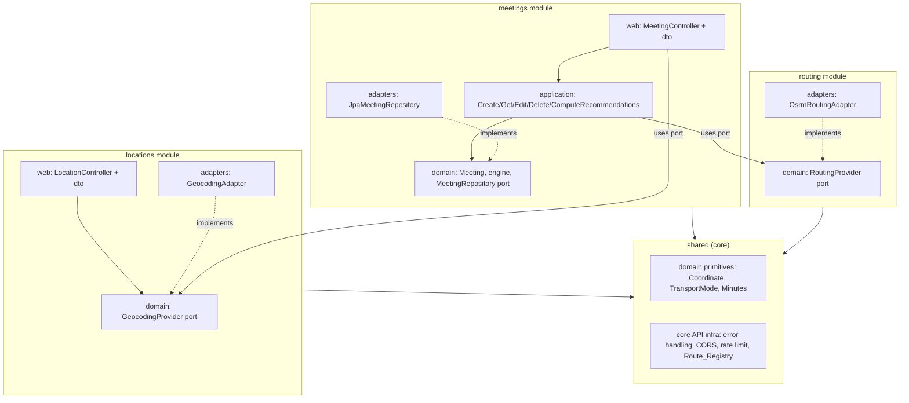
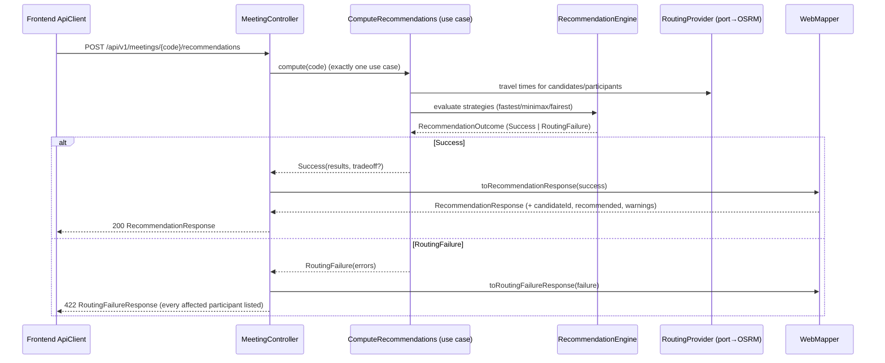
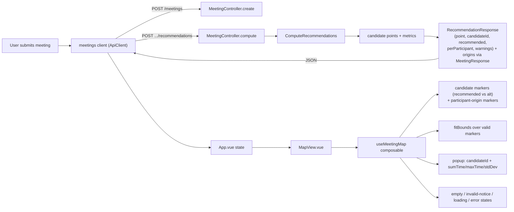

# Design Document

## Overview

This design covers an **incremental, behavior-preserving** reorganization of the MeetHalfway backend (Spring Boot, Java 21) and frontend (Vue 3.5 + TypeScript strict) from a **technical-layer-first** layout into a **domain-module-first** layout, plus one **additive** user-facing capability: a Leaflet map that visualizes computed meeting points. No optimization math, endpoint, or response contract changes semantics; code moves and a small amount of additive metadata and new UI is introduced (R1, R2, R12, R14).

The codebase already satisfies the hard parts of Clean/Hexagonal architecture:

- Domain is framework-free; application use cases use constructor injection; a single composition root (`BeanConfiguration`) wires everything; `ArchitectureRulesTest` (ArchUnit) mechanically enforces inward dependency direction, a framework-free domain, and no field injection.
- Controllers are already thin and delegate through use cases and a stateless `WebMapper`; DTO records form the API contract; a `@RestControllerAdvice` `GlobalExceptionHandler` produces a safe error envelope; a `RateLimitFilter` and `CorsConfigurer` handle cross-cutting HTTP concerns.

Those strengths are **preserved and reorganized, not rewritten** (R5.2, R5.3, R12). The structural problems this refactor targets are narrow:

1. A **single `MeetingController`** mixes meetings and geocoding concerns → split into two controllers (R2.5).
2. Code is grouped by **global technical folders** (`adapters/web`, `application`, `domain`) rather than by **domain module** → regroup by module (`meetings`, `locations`, `routing`, `shared`) (R2).
3. There is **no single readable place** listing the exposed API modules/routes → add a `Route_Registry` with a startup overlap check (R3).
4. The **frontend API layer** is one flat module (`meetingApi.ts`) → split into a shared `ApiClient` plus per-domain client modules (R9).

This document also reconciles the user's Django-inspired vocabulary ("central urls", "BaseApi") with idiomatic Spring conventions. Where a literal port conflicts with strong Spring/Vue conventions, the design records an explicit decision and adopts the **smallest maintainable alternative** (R3, R6).

### Terminology mapping (Django request → Spring/Vue design)

| User's term | This design |
| --- | --- |
| "apps" | Domain_Module (backend package group; frontend feature/client module) |
| "central urls.py" | `Route_Registry` constants class + startup overlap-check bean + exposure integration test (R3) |
| "controllers" | Spring `@RestController` classes, kept thin (R4) |
| "BaseApi" (base controller) | **Rejected** in favor of `@RestControllerAdvice` + filters + `ResponseEntity` (R6, ADR below) |

### Non-goals (unchanged)

No authentication, invitations, microservices, message queues, Redis/caching, event-driven architecture, CQRS, Kubernetes, additional databases, AI/LLM, speculative repository abstractions, complex GIS, or full UI redesign. The Leaflet map provides only marker rendering, bounds fitting, and marker inspection (R11.10).

## Architecture

### High-level architecture

The layered flow is unchanged; only the packaging changes. The frontend View talks to the backend exclusively over HTTP `/api/v1`; controllers delegate to use cases; use cases orchestrate the framework-free domain (engine + ports); adapters sit at the edges and reach PostgreSQL, OSRM (routing), and Nominatim (geocoding).

```mermaid
flowchart LR
  subgraph FE["Frontend (Vue 3.5 + TS) — View only"]
    App["App.vue / components"]
    Map["MapView.vue + useMeetingMap"]
    ApiClient["ApiClient + domain client modules"]
    App --> ApiClient
    Map --> App
  end

  subgraph BE["Backend (Spring Boot) — under app.meethalfway"]
    direction TB
    subgraph Web["Controllers (HTTP edge)"]
      MC["MeetingController (meetings)"]
      LC["LocationController (locations)"]
      HC["HealthController"]
    end
    subgraph UC["Use cases (application)"]
      CU["Create/Get/Edit/Delete/ComputeRecommendations"]
    end
    subgraph Dom["Domain (framework-free)"]
      Eng["RecommendationEngine + collaborators"]
      Ports["Provider ports"]
    end
    subgraph Adp["Adapters (infrastructure edge)"]
      Geo["GeocodingAdapter"]
      Rou["OsrmRoutingAdapter"]
      Per["JpaMeetingRepository"]
    end
  end

  DB[("PostgreSQL")]
  OSRM[["OSRM routing"]]
  NOM[["Nominatim geocoding"]]

  ApiClient -->|"HTTP /api/v1 (JSON)"| Web
  Web --> UC
  UC --> Dom
  Dom -. implemented by .-> Adp
  Per --> DB
  Rou --> OSRM
  Geo --> NOM
```



Key invariants (R1, R8):

- The frontend is a separate build unit and never imports backend code (R1.4, R8.6).
- The backend is reachable only through `/api/v1` (R1.2, R1.3).
- Dependencies point inward: Controller → UseCase → Domain/Ports; adapters implement ports at the edge and are wired only by the composition root (R8.1).

### Backend dependency direction (modules + layers)

Regrouping by domain module must not weaken the inward rule. Each module owns its slice of the four layers; cross-module dependencies are allowed only through `shared` (cross-cutting primitives and core API infra). `meetings`, `locations`, and `routing` must not depend on each other directly.



Notes:
- `ComputeRecommendations` (meetings/application) depends on the `RoutingProvider` **port** (routing/domain), never on the OSRM adapter — dependency inversion holds (R8, R14.2).
- `MeetingController` (meetings) uses the `GeocodingProvider` port only if needed; after the split, geocoding endpoints move to `LocationController` (locations), so meetings no longer needs the geocoding port at the web layer (R2.5).

### API request flow (compute recommendations)



### Meeting-point calculation → Leaflet visualization flow



The frontend renders only what the backend returns; it never recomputes points, routing, or scores (R10.1).

## Components and Interfaces

### Backend module boundaries (R2)

The backend is regrouped under `app.meethalfway` by domain module. Existing classes **move** into these packages with their public signatures and behavior intact (R5.2, R5.3, R12). Package-private visibility may be tightened where a type is only used within its module, but no computed result changes.

Proposed target directory tree:

```
app.meethalfway
├── MeetHalfwayApplication.java
├── shared/
│   ├── domain/
│   │   ├── Coordinate.java          # cross-module primitive (R2.4)
│   │   ├── TransportMode.java       # cross-module primitive (R2.4)
│   │   ├── Minutes.java             # cross-module primitive (R2.4)
│   │   └── ParticipantId.java       # shared identity primitive
│   ├── web/                         # core API infra (cross-cutting)
│   │   ├── GlobalExceptionHandler.java
│   │   ├── CorsConfigurer.java
│   │   ├── RateLimitFilter.java
│   │   ├── HealthController.java
│   │   ├── RouteRegistry.java        # NEW: single readable module→base-path list (R3.1)
│   │   ├── RouteRegistryVerifier.java# NEW: startup overlap check (R3.4)
│   │   └── dto/
│   │       ├── ErrorResponse.java
│   │       ├── FieldErrorResponse.java
│   │       └── CoordinateResponse.java   # shared coordinate wire shape
│   └── config/
│       ├── BeanConfiguration.java   # single composition root (unchanged role)
│       └── *Properties.java         # Engine/Routing/Geocoding/RateLimit/Cors
├── meetings/
│   ├── web/
│   │   ├── MeetingController.java   # meetings + recommendations only (R2.5)
│   │   └── dto/                     # meeting/recommendation DTOs + WebMapper
│   ├── application/
│   │   ├── CreateMeeting.java  GetMeeting.java  EditMeeting.java
│   │   ├── DeleteMeeting.java  ComputeRecommendations.java  UrlCodeGenerator.java
│   ├── domain/
│   │   ├── model/                   # Meeting, Minutes-consumers, StrategyResult(s), etc.
│   │   └── engine/                  # RecommendationEngine + all collaborators (R5)
│   └── adapters/
│       └── persistence/             # JpaMeetingRepository, entities, mapper, Spring Data
├── locations/
│   ├── web/
│   │   ├── LocationController.java  # NEW: /geocode/* (autocomplete, resolve) (R2.5)
│   │   └── dto/                     # AddressSuggestionResponse + geocoding mapping
│   ├── domain/port/GeocodingProvider.java  (+ GeocodeResult, AddressSuggestion)
│   └── adapters/geocoding/          # GeocodingAdapter, HttpExchange, JdkHttpExchange
└── routing/
    ├── domain/port/RoutingProvider.java (+ RouteResult)
    └── adapters/routing/OsrmRoutingAdapter.java
```

Decisions and justifications:

- **Recommendation engine lives in `meetings/domain/engine`** (R2.2). Computing meeting points is the meetings module's core business capability; `ComputeRecommendations` (meetings/application) is its only consumer. Placing it here keeps the capability cohesive and avoids a speculative shared "recommendations" module that would be an empty-ish placeholder (R2.3, R14.5).
- **Shared cross-module primitives** (`Coordinate`, `TransportMode`, `Minutes`, `ParticipantId`) live once in `shared/domain` (R2.4, R5.6). They are referenced by meetings (engine, DTOs), locations (coordinates in geocode results), and routing (coordinates as routing inputs). Defining them once prevents duplication.
- **`routing` is its own module** (R2.1) because its port is consumed by meetings' `ComputeRecommendations` but its adapter (OSRM) is an independent integration; keeping it separate documents that seam and lets the adapter be replaced without touching meetings (R14.2).
- **`PlacesProvider`/`StubPlacesProvider`**: `PlacesProvider` is an existing port with a stub adapter and no live endpoint. It is not a distinct HTTP module, so it stays as a port in `shared/domain/port` (or `locations/domain/port` if it is conceptually a location concern) with its stub adapter alongside; it introduces no placeholder module (R2.3). This design places it under `locations` since place lookup is a location concern; it exposes no route today, so it does not appear in the `Route_Registry`.
- **No empty modules** (R2.3): every listed module contains at least one production class.

The **single `MeetingController` is split** (R2.5): meeting CRUD + recommendations stay in `meetings/web/MeetingController`; `GET /geocode/autocomplete` and `GET /geocode/resolve` move to `locations/web/LocationController`. Neither controller serves both concerns afterward.

### Central route composition — Route_Registry (R3)

**Framework conflict (stated explicitly, per user instruction).** Django centralizes routes in a `urls.py`. Spring MVC has no such file: routes are declared per controller via `@RequestMapping`/`@GetMapping` annotations, and a literal central URL file would fight the framework and duplicate the annotations (two sources of truth that can drift). The **smallest maintainable alternative** is a readable registry of *module → owned base path* plus a startup guard and an exposure test, while each module keeps ownership of its concrete path segments and methods (R3.2).

Design:

- **`RouteRegistry`** (`shared/web`): a single class enumerating each API-exposing Domain_Module and the base path it owns, e.g. as an enum:
  ```
  enum ApiModule {
    MEETINGS("/api/v1/meetings"),
    LOCATIONS("/api/v1/geocode"),
    HEALTH("/api/v1/health");
    // base path accessor
  }
  ```
  This is the one place that documents the API surface at a glance (R3.1). Controllers reference these constants in their `@RequestMapping` (e.g. `@RequestMapping(RouteRegistry.MEETINGS)`), so the registry and the annotations share one source of truth for base paths (R3.2). All paths remain under `/api/v1` in kebab-case (R3.3).
- **`RouteRegistryVerifier`** (`shared/web`, a startup `@Component`/`ApplicationRunner` or `@PostConstruct` bean): fails application startup with a clear error naming the conflicting modules and base paths if any two registered base paths overlap (equal, or one a path-prefix of another) (R3.4). Because it runs at startup, an overlap can never ship silently.
- **Adding a new API module** appends one entry to `RouteRegistry` and its own controller; no unrelated module's routes are edited (R3.5).
- **Exposure integration test** (see Testing Strategy): asserts every base path declared in `RouteRegistry` is actually mapped by a controller and reachable (R3, R13.4), and the existing external paths/methods (meetings CRUD, recommendations, geocode autocomplete/resolve, health) are preserved (R3.6).

This is deliberately the minimum: constants + startup check + test, not a routing framework.

### Controller responsibilities (R4)

Both controllers honor the **thin-controller contract**: a handler does only (a) request binding, (b) triggering declarative validation (`@Valid`), (c) exactly one use-case (or port) delegation for the operation, and (d) mapping the result via `WebMapper` to a response + status (R4.1, R4.3, R4.4).

Forbidden in controllers (R4.2): business rules, scoring, meeting-point/routing/geographic algorithms, persistence query logic, direct external-provider client calls.

- `MeetingController` (meetings): `POST /meetings`, `GET /meetings/{code}`, `PUT /meetings/{code}`, `DELETE /meetings/{code}`, `POST /meetings/{code}/recommendations`. Each delegates to a single use case and maps through `WebMapper`.
- `LocationController` (locations): `GET /geocode/autocomplete`, `GET /geocode/resolve`. These delegate to the `GeocodingProvider` port (a domain port, not an adapter) and map through the mapper. Delegating to a port is consistent with the thin-controller rule; the controller performs no geocoding logic itself.

ArchUnit rules to add for the new packages (R4.5, R4.6): controllers (`..web..` controller classes) must not depend on adapter packages, engine classes, persistence query types, or concrete provider clients; a check that controller handler methods stay thin (e.g., no dependency on `..engine..`, `..adapters..persistence..`, or concrete adapter clients). The exact "≤ one non-trivial statement" check (R4.6) is approximated structurally by forbidding disallowed type references from controllers plus the delegation-exactly-once assertion in MockMvc tests (R13.2).

### Service / use-case and domain-utility responsibilities (R5)

Every existing engine collaborator and use case is a **single-responsibility** unit already; the refactor relocates them into `meetings/domain/engine` (or `meetings/application`) without rewriting (R5.2, R5.3). Mapping to the four named Domain_Utility concerns (R5.1):

| Concern (R5.1) | Existing classes (relocated, not rewritten) |
| --- | --- |
| Coordinate computation | `Coordinate` operations (shared), `GeographicCentroid`, `SearchRegion` |
| Scoring | `MetricCalculator`, `FastestSelector`, `MinimaxSelector`, `FairestSelector`, `StrategySelector`, `TieBreaker` |
| Validation | `MeetingValidator` |
| Geographic computation | `GridCandidateGenerator` / `CandidateGenerator`, `GeographicCentroid`, `SearchRegion` |
| (Outlier policy — scoring-adjacent) | `OutlierDetector` / `ConfiguredOutlierDetector` |

Orchestration lives in use cases (`ComputeRecommendations`, `CreateMeeting`, etc.), not utilities. There is no god service and no generic "utils" dump (R5.4, R5.5, R14.1). Logic used by more than one module is defined once in `shared` (R5.6). The 15% Fairest efficiency tolerance remains a fixed domain constant (`DomainConstants`), not configuration (per foundation "open decisions" and existing code).

### BaseApi decision — Architecture Decision Record (R6)

**Decision: REJECT a shared base controller (BaseApi) inheritance layer.** (R6.1 — one of the two allowed outcomes.)

**Justification (R6.1, R6.4, R6.5).** The cross-cutting HTTP concerns a BaseApi might centralize are already provided idiomatically by Spring and by existing named components, so a base class would duplicate them and violate the thin-controller / composition-over-inheritance principle:

- **Error handling and consistent error responses**: `GlobalExceptionHandler` (`@RestControllerAdvice`) already maps `VALIDATION_ERROR` → 400 with per-field errors, `NOT_FOUND` → 404, `IllegalArgumentException` → 400, routing failures → 422, and unexpected errors → a safe 500 envelope, never leaking secrets or stack traces. The shared response envelope is the `ErrorResponse`/`FieldErrorResponse` DTO plus the advice — not a base class (R6.2).
- **Common HTTP status mapping**: handled by `ResponseEntity` conventions in each handler and by the advice (R6.2).
- **CORS**: `CorsConfigurer` centralizes cross-origin policy for `/api/v1/**`.
- **Rate limiting**: `RateLimitFilter` (via `FilterRegistrationBean` on `/api/v1/*`) applies uniformly to all endpoints.
- **Input validation**: Bean Validation (`@Valid` + constraints on DTO records) triggers uniformly.

A BaseApi would have to re-expose these, giving it fewer than two *distinct, non-duplicative* purposes; by R6.4 it must therefore not be introduced, and this record documents the rejection with the specific reason (duplication of the advice, CORS config, and rate-limit filter named above) (R6.4, R6.5). Controllers instead stay thin and rely on these shared mechanisms.

### Frontend components and API architecture (R9)

Target frontend layout:

```
frontend/src/
├── api/
│   ├── client.ts            # ApiClient: base URL, transport, JSON (de)serialize, error normalization
│   ├── errors.ts            # ApiError, RoutingFailureError (preserved classes) (R9.4)
│   ├── meetings.ts          # meetings domain client (create/get/edit/delete/computeRecommendations)
│   ├── geocoding.ts         # geocoding domain client (autocomplete/resolve)
│   └── meetingApi.ts        # TEMPORARY re-export shim → removed after migration (R12)
├── features/
│   └── map/
│       ├── MapView.vue      # NEW Leaflet component
│       └── useMeetingMap.ts # NEW composable (markers/bounds/popups/states)
├── components/              # existing: MeetingForm, AddressSearchBox, StrategyComparisonView,
│                            #           OutlierTradeoffPanel, RoutingErrorNotice, LanguageSelector
├── composables/ (useTheme), i18n/, styles/, types/, utils/
└── App.vue                  # orchestrates create→compute→view; adds map slot
```

- **`ApiClient`** (`api/client.ts`) owns base URL (`/api/v1`), request transport, JSON serialization/deserialization, and shared error normalization. It preserves the existing conventions (R9.1, R9.6): `getMeeting` 404 → `null`; `resolve` 422 → `null`; other non-2xx → `ApiError`; recommendations 422 → `RoutingFailureError`.
- **Domain client modules** (R9.2): `api/meetings.ts` (create, get, edit, delete, computeRecommendations — recommendations grouped with meetings because they are addressed under `/meetings/{code}/recommendations` and always operate on a meeting) and `api/geocoding.ts` (autocomplete, resolve). All built on `ApiClient`; all typed against the contracts in `types/Meeting.ts` (R9.3).
- **Recommendations grouping decision**: recommendations are exposed as a sub-resource of a meeting and share the meeting's lifecycle, so they live in `api/meetings.ts` rather than a separate module — this avoids a thin module with a single call while still being a clearly named typed operation (R9.2, R14.5).
- Components and `App.vue` consume typed operations only; no ad-hoc `fetch` bypasses the client (R9.5).
- **Migration shim**: `meetingApi.ts` becomes a thin re-export of the new modules so existing imports keep working during migration (behavior preservation), then it and any dead code are removed once callers are migrated (R12).
- Frontend never imports backend code and calls only `/api/v1` (R1.4, R8.6, R9); provider secrets stay backend-only.

### Leaflet integration (R10, R11)

New dependencies: `leaflet` and `@types/leaflet` (frontend only). A `MapView.vue` feature component plus a `useMeetingMap` composable render the results the backend already computed.

- **Inputs (props)**: the strategy results (with new `candidateId` and `recommended` metadata), participant origins (from `MeetingResponse.participants[].location`), the response `warnings`, and the current request phase (loading/error/success). The map derives everything from the response — no recompute (R10.1).
- **Candidate markers** (R11.1, R11.2): one marker per candidate point (the 3 strategy points). The `recommended` candidate uses a visually distinct marker from alternatives.
- **Origin markers** (R11.5): one marker per participant origin (2–10), visually distinct from candidate markers.
- **Bounds** (R11.3): `L.latLngBounds` over all *valid* displayed markers, then `fitBounds`.
- **Popups** (R11.4): selecting a candidate marker shows its `candidateId` and metrics (`sumTime`, `maxTime`, `stdDev`).
- **Empty state** (R11.6): zero candidates → explicit empty-state message, no markers.
- **Invalid coordinates** (R11.7): a candidate or origin outside lat [-90,90] / lng [-180,180] is excluded from rendering and surfaced via a non-blocking notice identifying the excluded point (mirrors backend `warnings`).
- **Loading state** (R11.8): while a recommendation request is in flight.
- **Error state** (R11.9): on request failure, shows the error and clears stale markers so a previous response is never shown as current.
- **Placement**: slots into `App.vue` after `StrategyComparisonView` (results section), driven by the same `recommendation`/`submitting`/`errorMessage` refs already present.
- **Implementation note (Vite marker assets)**: Leaflet's default marker icon paths break under Vite bundling; the composable applies the standard `L.Icon.Default` image-path fix (import marker/marker-2x/shadow URLs and set them) so markers render.
- **Scope guard** (R11.10): only marker rendering, bounds fitting, and marker inspection — no advanced GIS.

## Data Models

All DTO changes are **additive** (R10.8): existing fields are neither removed nor renamed, so the existing response contract is preserved (R7.8, R12). New fields are optional/nullable so existing clients keep working.

### Backend DTO additions (R10)

`StrategyResultResponse` gains a stable candidate identifier and a recommended indicator:

```java
public record StrategyResultResponse(
        CoordinateResponse point,
        Map<String, Integer> perParticipant,
        double sumTime,
        int maxTime,
        double stdDev,
        String candidateId,   // NEW: stable id = strategy key "fastest"|"minimax"|"fairest" (R10.2)
        boolean recommended   // NEW: exactly one recommended point per strategy (R10.4)
) {}
```

- **`candidateId`** (R10.2): the strategy key (`"fastest"`, `"minimax"`, `"fairest"`) uniquely maps a candidate point to its strategy and is stable across responses. No new endpoint or lookup is needed.
- **`recommended`** (R10.4): each strategy returns exactly one selected point, which is its recommended point; `recommended = true` marks it so the frontend can distinguish it from alternatives. (With one point per strategy today, the recommended point is that point; the flag makes the intent explicit and future-proofs alternatives.)
- Existing fields (`point{lat,lng}`, `perParticipant`, `sumTime`, `maxTime`, `stdDev`) are unchanged (R7.8, R10.2, R10.3).

`RecommendationResponse` gains an optional warnings list to surface out-of-range coordinates without rejecting the whole response (R10.7, R10.9):

```java
public record RecommendationResponse(
        StrategyResultsResponse results,
        OutlierTradeoffResponse outlierTradeoff,
        List<CoordinateWarningResponse> warnings   // NEW: empty list when none (R10.7, R10.9)
) {}

public record CoordinateWarningResponse(
        String kind,        // "CANDIDATE" | "PARTICIPANT_ORIGIN"
        String reference,   // candidateId or participantId
        double lat,
        double lng,
        String reason       // e.g. "latitude 91.0 outside [-90,90]"
) {}
```

Behavior for out-of-range coordinates (R10.6, R10.7, R10.9): valid latitudes are in [-90,90] and longitudes in [-180,180]. An invalid **candidate** point is excluded from `results` for that strategy path and a warning is added (the remaining valid candidates are still returned); an invalid **participant origin** is reported as a warning rather than silently omitted. Warnings never remove existing fields; `warnings` defaults to an empty list, so the change is backward-compatible.

Participant origins are already carried by `MeetingResponse.participants[].location` (`CoordinateResponse`) (R10.5); the map consumes those directly. No change is required to `MeetingResponse`, but its role as the origin source is documented here.

### Frontend type additions (mirrors, R9.3)

`types/Meeting.ts` mirrors the additive backend fields:

```ts
export interface StrategyResult {
  point: Coordinate
  perParticipant: Record<string, number>
  sumTime: number
  maxTime: number
  stdDev: number
  candidateId: StrategyKey   // NEW (R10.2)
  recommended: boolean       // NEW (R10.4)
}

export interface CoordinateWarning {           // NEW
  kind: 'CANDIDATE' | 'PARTICIPANT_ORIGIN'
  reference: string
  lat: number
  lng: number
  reason: string
}

export interface Recommendation {
  results: StrategyResults
  outlierTradeoff: OutlierTradeoff | null
  warnings: CoordinateWarning[]   // NEW; may be empty (R10.7, R10.9)
}
```

These are additive to the existing typed contracts; `candidateId`/`recommended`/`warnings` are populated by the backend and consumed by `MapView`. Existing fields are untouched (R7.8, R12).

### Domain models (unchanged)

Domain records (`Coordinate`, `Meeting`, `Minutes`, `StrategyResult`, `StrategyResults`, `RecommendationOutcome`, `OutlierTradeoff`, etc.) keep their signatures and invariants; they only move packages (R5.3). Domain records are never serialized directly (R7.2); the `WebMapper` maps them to DTOs, and it is the mapper that populates the new `candidateId`/`recommended`/`warnings` fields from domain data (e.g., strategy key and coordinate-range checks) during mapping — no domain type changes.

## Correctness Properties

*A property is a characteristic or behavior that should hold true across all valid executions of a system — essentially, a formal statement about what the system should do. Properties serve as the bridge between human-readable specifications and machine-verifiable correctness guarantees.*

This feature is mostly a behavior-preserving structural refactor; the bulk of its acceptance criteria are verified structurally (ArchUnit rules, startup checks, integration/MockMvc tests, and Vue rendering tests — see Testing Strategy). Property-based testing applies to two families that DO have universal, input-varying guarantees: the **preserved geospatial/mathematical optimization invariants** that R13.6 explicitly mandates keeping, and the **additive display-data invariants** introduced by R10 in the `WebMapper`. The properties below are the ones this refactor must maintain or add; the enumerated existing property tests (R13.6) are preserved through relocation with only import/package updates and are listed at the end so they are not duplicated.

### Property 1: Output coordinates are within valid ranges

*For any* meeting and its computed recommendation, every latitude in every returned candidate point (and every returned participant origin) is within the inclusive range -90 to 90 and every longitude is within the inclusive range -180 to 180.

**Validates: Requirements 10.6, 13.6**

### Property 2: Results are independent of participant input ordering

*For any* meeting, computing the recommendation on the participant list and on any permutation of that same list produces identical strategy results (same points and metrics).

**Validates: Requirements 13.6**

### Property 3: Reported travel times are non-negative

*For any* computed recommendation, every reported travel time (each per-participant time and each aggregate `sumTime`/`maxTime`/`stdDev`) is greater than or equal to zero.

**Validates: Requirements 13.6**

### Property 4: Minimax minimizes the maximum participant travel time

*For any* meeting with a non-empty feasible candidate set, the Minimax selection's maximum per-participant travel time is less than or equal to that of every other feasible candidate point.

**Validates: Requirements 13.6**

### Property 5: Fastest minimizes aggregate travel time

*For any* meeting with a non-empty feasible candidate set, the Fastest selection's aggregate travel time is less than or equal to that of every other feasible candidate point.

**Validates: Requirements 13.6**

### Property 6: Display metadata is complete for every candidate point

*For any* successful recommendation, each returned strategy result carries latitude, longitude, total time, maximum single-participant time, standard deviation, a per-participant travel time for every included participant, a `candidateId` equal to that result's strategy key (`fastest`, `minimax`, or `fairest`), and exactly one point per strategy marked `recommended`.

**Validates: Requirements 10.2, 10.3, 10.4**

### Property 7: Out-of-range candidate points are excluded transparently

*For any* set of computed candidate points containing one or more coordinates outside the valid latitude/longitude ranges, the response excludes exactly those invalid candidate points, retains all valid candidate points, and includes a warning identifying each excluded out-of-range coordinate (never silently omitting it and never rejecting the whole response).

**Validates: Requirements 10.7**

### Property 8: Out-of-range participant origins are reported as warnings

*For any* meeting containing one or more participant-origin coordinates outside the valid latitude/longitude ranges, the response includes a warning identifying each out-of-range participant origin rather than silently omitting it.

**Validates: Requirements 10.9**

### Preserved existing property tests (maintained through relocation)

These property tests already exist and MUST keep passing after the module relocation, with changes limited to imports/package declarations (behavior preservation, R5.2, R12.3, R13.6). They are not re-derived here:

- `TieBreakTotalityPropertyTest` — deterministic total tie-breaking (Validates: Requirements 13.6)
- `RoutingFailureTransparencyPropertyTest` — every affected participant reported on 422, none omitted (Validates: Requirements 7.6, 13.6)
- `ResultsCompletenessPropertyTest` — every strategy result complete (Validates: Requirements 8, 13.6)
- `OutlierTransparencyPropertyTest` — include/exclude trade-off surfaced transparently (Validates: Requirements 13.6)
- `OutlierDetectionPropertyTest` — outlier detection invariants (Validates: Requirements 13.6)
- `MinutesPropertyTest` — `Minutes` value invariants incl. non-negativity (Validates: Requirements 13.6)
- `MeetingInputParticipantCountPropertyTest` — participant count 2–10 enforced (Validates: Requirements 7.4, 13.6)
- `TransportModeValidationPropertyTest` — only DRIVING/WALKING accepted (Validates: Requirements 7.4, 13.6)

## Error Handling

Error handling is preserved end-to-end and consolidated here; no status codes or envelope shapes change (R7, R12).

### Backend

- **Central mapping via `@RestControllerAdvice` (`GlobalExceptionHandler`)** — the single place that maps exceptions to the `ErrorResponse`/`FieldErrorResponse` envelope. No base controller is involved (R6.2).
  - Bean Validation failure → **400** `VALIDATION_ERROR` with each failing field named and the rule it violated; no stack traces or provider internals (R7.3).
  - Domain-rule violation (e.g., participant count outside 2–10, mode other than DRIVING/WALKING) via `IllegalArgumentException` → **400** naming the violated rule and offending value (R7.4).
  - Unknown meeting (`NoSuchElementException`) → **404** `NOT_FOUND` (R7, behavior-preserving).
  - Unexpected server error → **500** with a safe envelope excluding secrets, stack traces, exception class names, and provider internals (R7.5).
- **Routing failure is an outcome, not an exception**: `ComputeRecommendations` returns `RecommendationOutcome.RoutingFailure`; `MeetingController` maps it to **422** `RoutingFailureResponse` listing every affected participant location and its specific reason — a participant is never silently dropped (R7.6). This transparency invariant is covered by `RoutingFailureTransparencyPropertyTest`.
- **Geocode resolve not found** → **422** `GEOCODE_NOT_FOUND` with an actionable reason (behavior-preserving), now served by `LocationController`.
- **Out-of-range coordinates in results** → included as `warnings` in the 200 `RecommendationResponse` (invalid candidate excluded, valid ones kept; invalid origin reported), never causing a whole-response rejection (R10.7, R10.9; Properties 7, 8).

### Frontend

- **`ApiClient` normalizes errors** into the preserved typed classes (R9.4):
  - Non-2xx that is not a routing failure → `ApiError(status, message)`.
  - Recommendations **422** → `RoutingFailureError(failure)` carrying all affected participants.
  - `getMeeting` **404** → `null`; `resolve` **422** → `null` (R9.6).
- **`App.vue` / `MapView` state mapping**:
  - Loading: `submitting` true while a request is in flight → map loading state (R11.8).
  - Routing failure: `RoutingErrorNotice` shows each participant and reason with a correction/removal action (never hidden).
  - Generic error: error message shown; `MapView` clears stale markers so a previous response is not shown as current (R11.9).
  - Empty: zero candidates → explicit empty-state, no markers (R11.6).
  - Invalid coordinates: excluded from rendering with a non-blocking notice identifying the excluded point, mirroring backend `warnings` (R11.7).

## Testing Strategy

The strategy keeps the existing balanced suite (unit, integration, property, MockMvc, frontend Vitest) green throughout the refactor and adds focused tests for the new seams. Target ≥ 80% MVP coverage. CI on every PR runs lint, type/static check, unit tests, property tests, and build; E2E runs on `main`.

**Dual approach**: unit/example tests for concrete behavior, edge cases, and error conditions; property tests for the universal invariants in the Correctness Properties section. Both are necessary.

### Backend

- **Unit tests (no sockets/DB, test doubles for HTTP/persistence, R13.1)**: use cases (`ComputeRecommendations`, `Create/Get/Edit/DeleteMeeting`) with fake `RoutingProvider`/`GeocodingProvider`/`MeetingRepository`; `MetricCalculator` scoring; geographic/coordinate utilities (`GeographicCentroid`, `SearchRegion`, `Coordinate`). These relocate with the code and keep passing.
- **Controller / API tests (MockMvc, per new controller, R13.2, R13.3)**:
  - `MeetingController` and `LocationController` each: validation → **400** with the specific failure and **no use-case invocation** for invalid input (R13.3, must exist and pass); success status/contract; error contract; and **delegation exactly once** to the use case per valid request (verified with a mock use case).
  - Preserve existing `MeetingControllerTest`, `GeocodingEndpointTest`, `WebMapperTest`, `ResponseDtoSecrecyTest` (split/relocate as controllers split).
- **Integration tests**:
  - **Route_Registry exposure** (R3, R13.4): assert every base path declared in `RouteRegistry` is exposed exactly as declared (path + method) and wired to its controller/service.
  - **Overlapping base paths fail at startup** (R3.4): a context-startup test with two overlapping registrations asserts a clear startup failure naming the conflict.
  - Persistence round-trip (`JpaMeetingRepositoryCrudTest`, `MeetingPersistenceRoundTripPropertyTest`) preserved.
- **Architecture tests (ArchUnit, extend `ArchitectureRulesTest`, R1.5, R4.5, R4.6, R8.1–8.4, R14.3)**:
  - Keep inward-dependency, framework-free-domain, no-field-injection rules.
  - Add module-boundary rules for `meetings`/`locations`/`routing`/`shared`: no forbidden cross-module dependency (e.g., `meetings` must not depend on `locations` implementation), no cycles.
  - Add controller-restriction rules: controllers must not reference adapter packages, `..engine..`, persistence query types, or concrete provider clients; controllers depend only on use cases, domain ports, and the mapper.
  - Add no-catch-all-utility / duplicate-code guards where feasible.
- **Property tests (jqwik, ≥ 100 iterations each, R13.6)**: maintain the enumerated existing property tests through relocation; add tests for Properties 1–8 above where not already covered. Each property test is tagged `Feature: modular-architecture-refactor, Property {n}: {property text}`. Preserve strategy coverage (R13.7): each of the three strategies independently, epsilon-boundary ties at the Fairest tolerance, empty feasible Fairest set, outlier comparisons, exactly-2 and exactly-10 participants, both DRIVING and WALKING, and at least one unroutable location.
- **OpenAPI (R7.7, additive)**: optionally add `springdoc-openapi-starter-webmvc-ui`; when present, a test asserts documented paths/DTO schemas/field names match the exposed endpoints. This is additive and behavior-preserving; if the dependency is not added, R7.7 ("WHERE the toolchain supports it") is satisfied vacuously and the task is optional.

### Frontend (Vitest + @vue/test-utils, R13.5)

- **`ApiClient` and domain client modules**: mocked-response unit tests for each preserved convention — `getMeeting` 404 → `null`, `resolve` 422 → `null`, recommendations 422 → `RoutingFailureError`, other non-2xx → `ApiError`, and correct base URL/serialization (R9). Assert components use the client (no ad-hoc `fetch`).
- **`MapView` rendering (R13.5)**: candidate markers (one per candidate), recommended-vs-alternative distinction, 2–10 origin markers distinct from candidates, bounds fitting, popup content (`candidateId` + metrics). Each of the **loading**, **error**, and **empty** states has at least one test asserting its rendered output; invalid-coordinate exclusion shows the non-blocking notice.
- **Pure frontend invariants (fast-check)**: if any pure helper is added (e.g., a filter that drops out-of-range coordinates before rendering), assert its invariant with a property test; UI rendering itself stays example/snapshot-based (PBT is not used for rendering).
- **E2E (Playwright, on `main`, sparingly)**: create a meeting, edit a meeting, view results (now including the map), and handle routing errors.

### Behavior-preservation gate (R12)

Every migration increment runs the full backend (`mvn verify`) and frontend (`vitest --run`, type-check, lint) suites and must leave them green and the app buildable/runnable (R12.2, R12.3). Any observable contract change is documented before it is considered complete (R12.4); the additive DTO fields (`candidateId`, `recommended`, `warnings`) are backward-compatible and documented here.

## Dependency Direction (allowed / forbidden)

Documented allowed and forbidden directions (R8.5):

**Allowed:**
- Frontend → HTTP `/api/v1` → Controller.
- Controller → Use_Case (application) → Domain (models, engine) and Provider_Ports.
- Adapters implement Provider_Ports and are wired only by the composition root (`BeanConfiguration`).
- `meetings`, `locations`, `routing` → `shared` (primitives + core API infra).
- `meetings/application` (`ComputeRecommendations`) → `routing` domain **port**; `locations`/`meetings` web → `locations` domain **port** — always ports, never adapters.

**Forbidden (asserted mechanically):**
- Domain or application depending on Controller, adapter, config, or framework types (Spring/JPA/servlet/Hibernate) (R8.1, R8.4).
- Controllers depending on adapters, the engine, persistence query types, or concrete provider clients directly (R4.2, R4.5).
- `meetings` ↔ `locations` (or any peer module) depending on each other's implementation; cross-module use goes through `shared` or a domain port (R8.2).
- Any circular dependency between packages/modules (R8.3, R14.3).
- Frontend importing backend implementation code (R1.4, R8.6).

**Frontend↔backend separation (R8.6)**: the frontend and backend are separate build units (separate `package.json` / Maven), so a backend import from the frontend cannot resolve and the frontend build fails naturally. This is additionally asserted by an ESLint `no-restricted-imports` rule (or an equivalent test) forbidding imports from backend paths, giving an explicit error identifying the offending import path.

ArchUnit is extended to enforce the backend rules over the new module packages; the layered rule is re-expressed in module-aware terms (each module's `web → application → domain`, adapters at the edge wired by config).

## Migration Strategy (incremental, behavior-preserving)

The refactor proceeds in small, always-buildable steps aligned to the 14-point migration order. After **each** step the full backend and frontend suites run and must stay green and the app buildable/runnable (R12.2, R12.3). Prefer moving/relocating code over rewriting; call out what stays unchanged.

1. **Establish target module packages** — create `shared`, `meetings`, `locations`, `routing` package skeletons (no empty modules will remain by the end; classes move in subsequent steps) (R2).
2. **Introduce `Route_Registry` + shared/core API infra** — add `RouteRegistry` constants and `RouteRegistryVerifier` (startup overlap check); relocate `GlobalExceptionHandler`, `CorsConfigurer`, `RateLimitFilter`, `HealthController`, shared error DTOs into `shared/web`; wire the verifier in the composition root (R3, R6).
3. **Move meetings code into the `meetings` module** — relocate `MeetingController` (meetings endpoints), meeting/recommendation DTOs, `WebMapper`, use cases, and persistence adapter; update `@RequestMapping` to reference `RouteRegistry.MEETINGS`. No behavior change (R2.2, R12).
4. **Split geocoding into the `locations` module** — extract `LocationController` for `/geocode/*` from `MeetingController`; relocate `GeocodingProvider` port + `GeocodingAdapter`; reference `RouteRegistry.LOCATIONS`. After this step no controller serves both concerns (R2.5).
5. **Relocate engine/domain into `meetings`/`shared` without behavior change** — move the recommendation engine and its collaborators into `meetings/domain/engine`, and cross-module primitives (`Coordinate`, `TransportMode`, `Minutes`, `ParticipantId`) into `shared/domain`; `routing` port/adapter into `routing`. Public signatures and computed results unchanged (R5.2, R5.3).
6. **Extend ArchUnit rules** — add module-boundary, cycle, controller-restriction, and framework-free-domain rules for the new packages; confirm they fail on injected violations and pass on the real code (R1.5, R4.5, R8.2–8.4).
7. **Add additive display metadata to DTOs + TS types** — add `candidateId` and `recommended` to `StrategyResultResponse`, add `warnings` to `RecommendationResponse` (+ `CoordinateWarningResponse`), populate them in `WebMapper`; mirror in `types/Meeting.ts`. Additive only — no field removed/renamed; document the additive change (R10.8, R12.4).
8. **Add frontend `ApiClient` + domain client modules (with temporary re-export shim)** — create `api/client.ts`, `api/errors.ts`, `api/meetings.ts`, `api/geocoding.ts`; turn `meetingApi.ts` into a thin re-export shim so existing imports keep working (R9, R12).
9. **Migrate `App.vue`/components to typed clients** — switch imports from `meetingApi.ts` to the domain client modules; ensure no ad-hoc `fetch` remains (R9.5).
10. **Add Leaflet `MapView`** — add `leaflet`/`@types/leaflet`, implement `features/map/MapView.vue` + `useMeetingMap` (candidate/recommended/origin markers, bounds, popups, empty/invalid/loading/error states, Vite icon fix); slot into `App.vue` after results (R10, R11).
11. **Remove the flat `meetingApi.ts` shim and dead code** — after all callers use the domain modules and tests are green, delete the shim and any now-unused code (R14.3 no dead code).
12. **Run full backend + frontend tests each step** — the behavior-preservation gate; also verify preserved property tests and strategy coverage remain green (R12.3, R13.6, R13.7).

Each step keeps the application buildable and existing tests green (R12.2, R12.3). The only observable contract change is the additive DTO fields, which are backward-compatible and documented in Data Models (R12.4).

## Requirements Coverage Summary

| Requirement | Addressed in |
| --- | --- |
| R1 Layer separation | Overview, Architecture, Dependency Direction |
| R2 Domain-module backend | Backend module boundaries (tree, decisions) |
| R3 Route_Registry | Central route composition (registry + startup check + test) |
| R4 Thin controllers | Controller responsibilities |
| R5 Services/utilities | Service/use-case & domain-utility responsibilities |
| R6 BaseApi decision | ADR (reject) |
| R7 REST contracts | API contract conventions, Error Handling, Data Models |
| R8 Dependency direction | Dependency Direction, ArchUnit extensions |
| R9 Frontend API client | Frontend API architecture |
| R10 Display-ready data | Data Models (additive DTOs), Properties 6–8 |
| R11 Leaflet map | Leaflet integration, Error Handling (states) |
| R12 Behavior preservation | Migration Strategy, behavior-preservation gate |
| R13 Testability | Testing Strategy, Correctness Properties |
| R14 Code quality | Module boundaries, ADR, ArchUnit, Dependency Direction |
